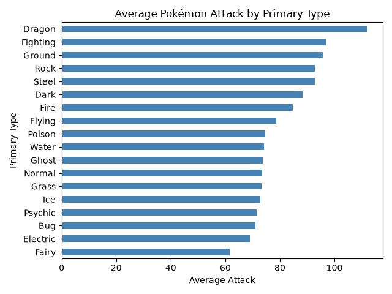

# Pokémon Data Analysis

## About the Project 

This project uses Python to explore Pokémon statistics. I looked at
Pokémon types and Attack values. I also used a decision tree to predict
whether a Pokémon is Legendary.

## Dataset

I used the
[Pokemon with stats](https://www.kaggle.com/datasets/abcsds/pokemon)
dataset from Kaggle. It has 800 rows and 13 columns.

## Setup

```bash
conda create --prefix ./.venv python=3.12 -y
conda activate ./.venv
python -m pip install -r requirements.txt
```

## Run

Run the Pandas analysis:

```bash
python analysis.py
```

Run the Polars analysis:

```bash
python polars_analysis.py
```

## What I Did

- Viewed the first rows and summary statistics.
- Checked missing values and duplicate rows.
- Filtered Pokémon with Attack values of 120 or higher.
- Grouped Pokémon by their primary type.
- Created a chart of average Attack by type.
- Used a decision tree to predict Legendary status.
- Compared grouping with Pandas and Polars.

## Results

- `Type 2` has 386 missing values because some Pokémon have only one type.
- There are no fully duplicated rows.
- 100 Pokémon have an Attack value of at least 120.
- Water is the most common primary type, with 112 records.
- Dragon has the highest average Attack at 112.12.
- The decision tree model had an accuracy of 0.93.

The Legendary groups are not balanced, so accuracy does not explain
everything about the model.

## Visualization



I used a horizontal bar chart because it makes the Pokémon type names
easy to read and compare.

## Pandas and Polars

Both libraries produced the same grouped results. For 1,000 grouping
operations, Pandas took 0.1161 seconds and Polars took 0.2133 seconds.

Pandas was faster in this small test, but this dataset only has 800 rows.