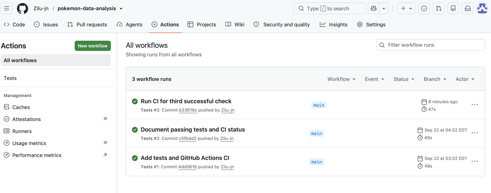
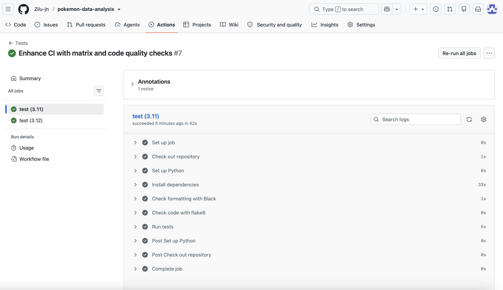
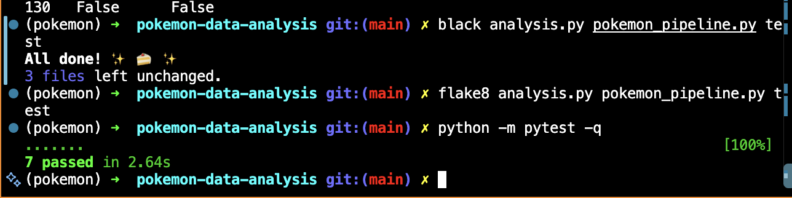
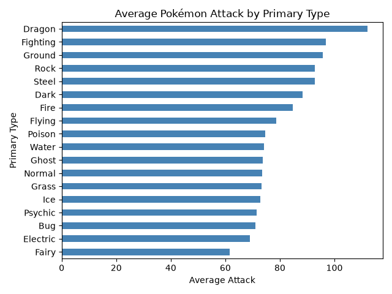
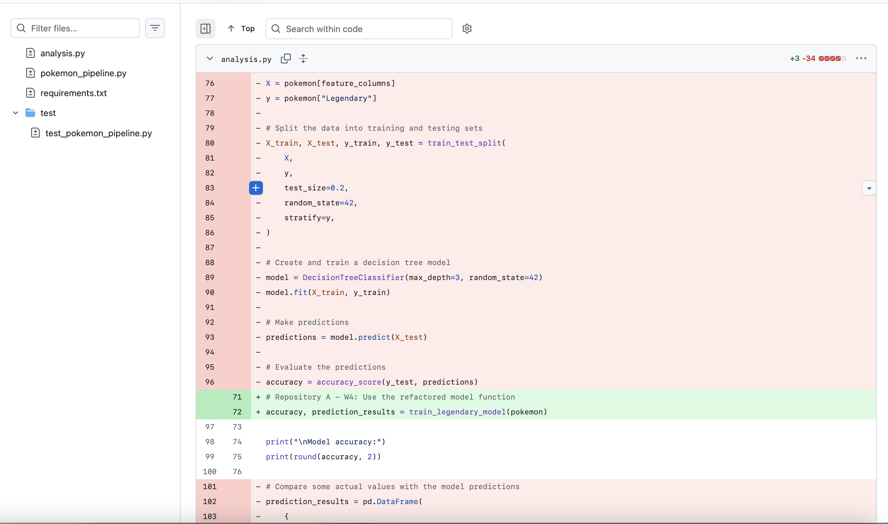
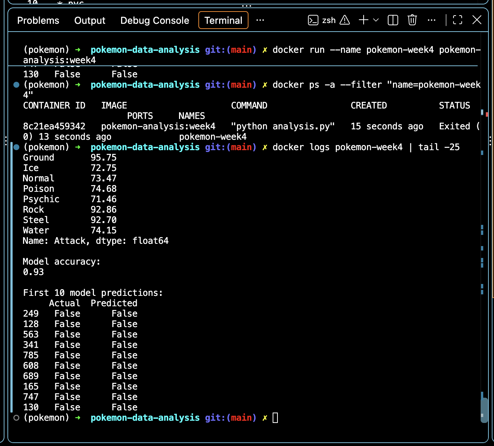

# Pokémon Data Analysis

# Part 2: GitHub Actions CI status

## Three Successful CI Runs

The GitHub Actions workflow ran successfully three times.



[](https://github.com/Zilu-jn/pokemon-data-analysis/actions/workflows/tests.yml)

## Repository A - W4: Enhanced Continuous Integration

The GitHub Actions workflow now tests the project with Python 3.11 and
Python 3.12. Each CI job installs the dependencies, checks formatting with
Black, checks code quality with flake8, and runs all tests.

The workflow runs on pushes, pull requests, a weekly schedule, and manual
workflow requests.



## About the Project 

This project uses Python to explore Pokémon statistics. I looked at
Pokémon types and Attack values. I also used a decision tree to predict
whether a Pokémon is Legendary.

## Problem Statement

This project helps Pokémon players compare offensive strength across primary
types and investigate whether base statistics can help identify Legendary
Pokémon. The results can support simple team-building and Pokémon comparison
decisions.

## Repository A - W4: Data Quality Decisions

- The dataset has 386 missing `Type 2` values. These values represent Pokémon
  that have only one type, so I kept them as meaningful missing values.
- The dataset has no fully duplicated rows.
- I used the IQR method to identify 7 unusual Attack values.
- I reviewed these records and kept them because they represent legitimately
  powerful Pokémon rather than data-entry errors.

## Dataset

I used the
[Pokemon with stats](https://www.kaggle.com/datasets/abcsds/pokemon)
dataset from Kaggle. It has 800 rows and 13 columns.

## Setup

```bash
conda create -n pokemon python=3.12 pip -y
conda activate pokemon
python -m pip install -r requirements.txt
```

## Run

Run the Pandas analysis:

```bash
python analysis.py
```

Run the Polars analysis:

```bash
python polars_analysis.py
```
## Part 1: Test results

The project has six unit tests and one complete workflow test. All seven pass:


## What I Did

- Viewed the first rows and summary statistics.
- Checked missing values and duplicate rows.
- Filtered Pokémon with Attack values of 120 or higher.
- Grouped Pokémon by their primary type.
- Created a chart of average Attack by type.
- Used a decision tree to predict Legendary status.
- Compared grouping with Pandas and Polars.

## Results

- `Type 2` has 386 missing values because some Pokémon have only one type.
- There are no fully duplicated rows.
- 100 Pokémon have an Attack value of at least 120.
- Water is the most common primary type, with 112 records.
- Dragon has the highest average Attack at 112.12.
- The decision tree model had an accuracy of 0.93.

The Legendary groups are not balanced, so accuracy does not explain
everything about the model.

- The IQR method identified 7 Attack outliers. They were retained because they are valid high-powered Pokémon.

## Visualization



I used a horizontal bar chart because it makes the Pokémon type names
easy to read and compare.

## Pandas and Polars

Both libraries produced the same grouped results. For 1,000 grouping
operations, Pandas took 0.1161 seconds and Polars took 0.2133 seconds.

Pandas was faster in this small test, but this dataset only has 800 rows.

## Repository A - Week 4: Refactoring and Code Quality

> **Refactoring Motto:** “Refactor used Clean Code — it’s super effective!”

### What I Changed

I moved the decision tree training code from `analysis.py` into a reusable
function named `train_legendary_model()` in `pokemon_pipeline.py`.

I also added a new test for the refactored function.

### Why I Changed It

The change makes `analysis.py` shorter and easier to read. The model training
code can now be reused and tested separately.

### How I Verified It

I used the following commands:

```bash
python -m pytest -q
black --check analysis.py pokemon_pipeline.py test
flake8 analysis.py pokemon_pipeline.py test
```

All six tests passed. Black and flake8 also passed.

### Before-and-After Refactoring Evidence

The red lines show the longer model-training code that was removed. The green
lines show the new function call.



## Repository A - Week 4: Docker and Containerization

### Build the Docker Image

```bash
docker build -t pokemon-analysis:week4 .
```

### Run the Docker Container

```bash
docker run --rm pokemon-analysis:week4
```

### What I Learned

The Dockerfile creates a reproducible Python 3.12 environment, installs the
project dependencies, copies the analysis code and dataset, and runs the
Pokémon analysis automatically.

The `.dockerignore` file prevents unnecessary files from being copied into the
Docker image. The container completed successfully and produced the same model
accuracy of 0.93.

### Docker Evidence

The screenshot below shows the completed container, its successful exit code,
and the analysis output.

